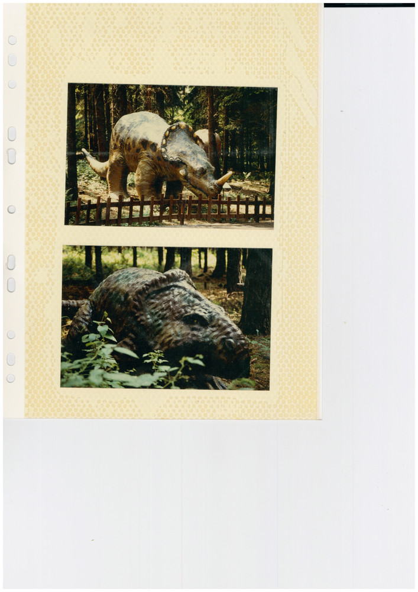
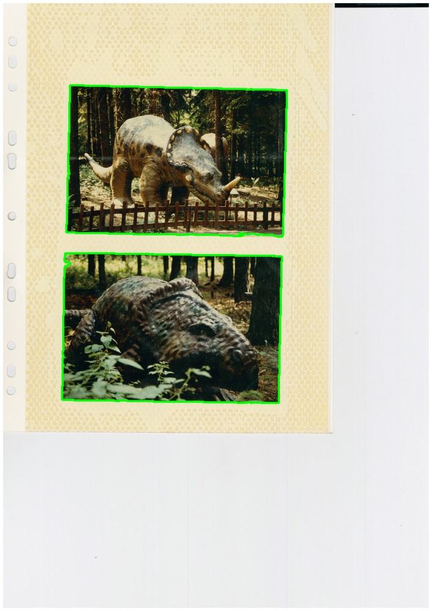
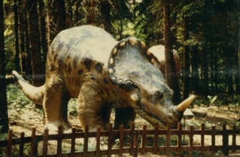
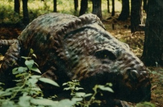

# zerhacker
Extract individual images from a single scanned photo album page.

| Scanned image | Detected contours | Extracted images |
| :-----------: |:-----------------:| :---------------:|
|  |  |      |

Strongly inspired by https://github.com/z80z80z80/autocrop and other similar repos.